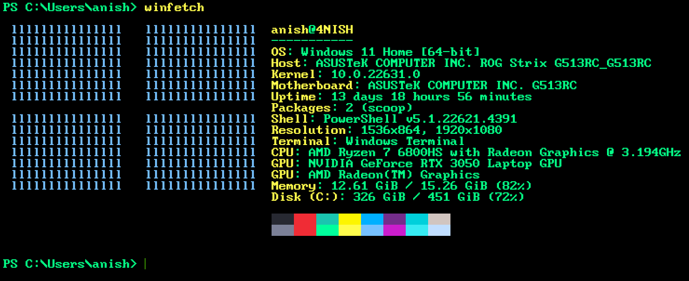

# CyberPunk2077-umbra-WindowsTerminal
CyberPunk2077-Umbra-Windows Terminal with a bright green cursor and pitch black background instead

## Installation

Open Windows Terminal, press the dropdown, press settings, press open JSON file, copy the json contents from this directory under schemes.
